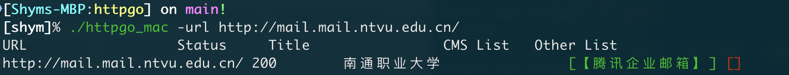
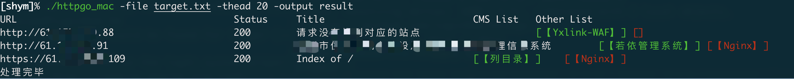
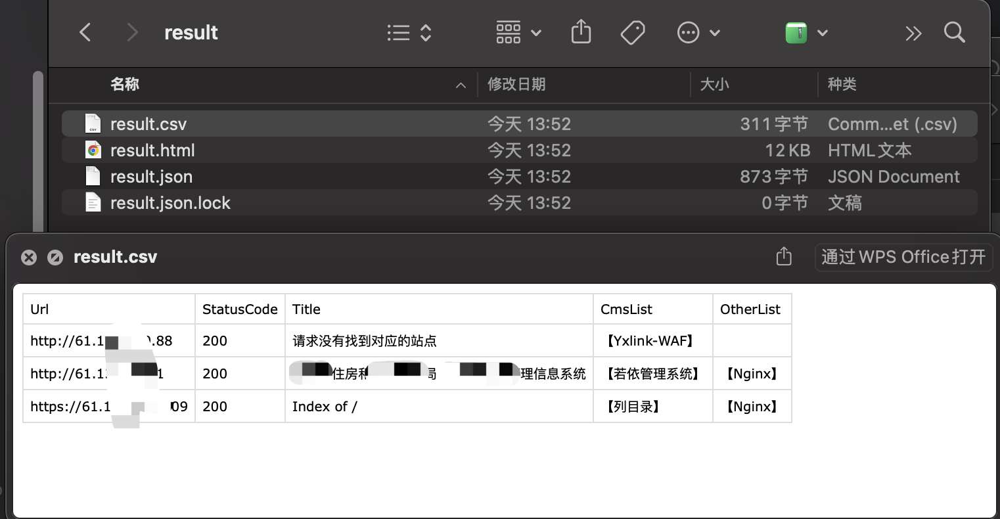
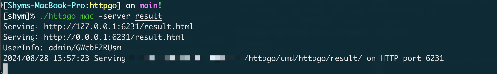
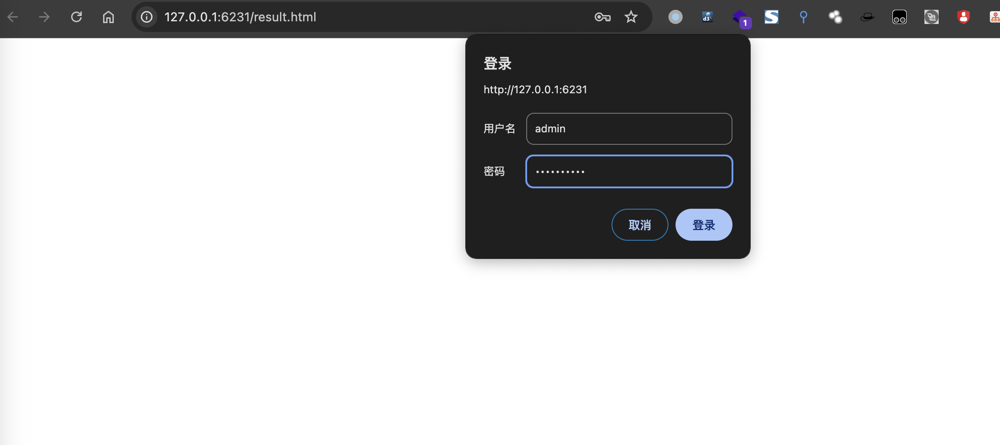
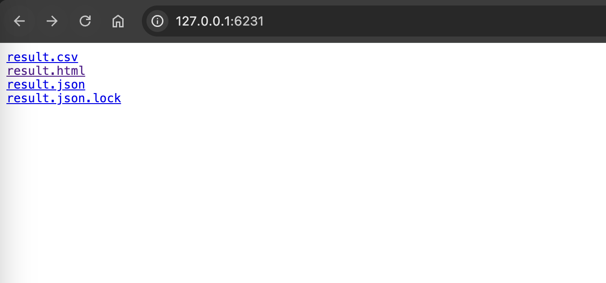
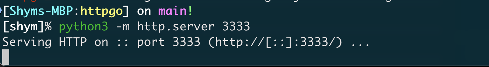
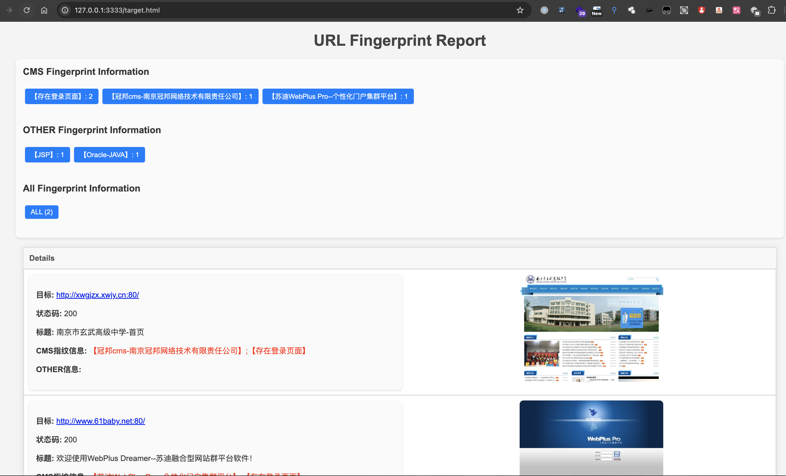
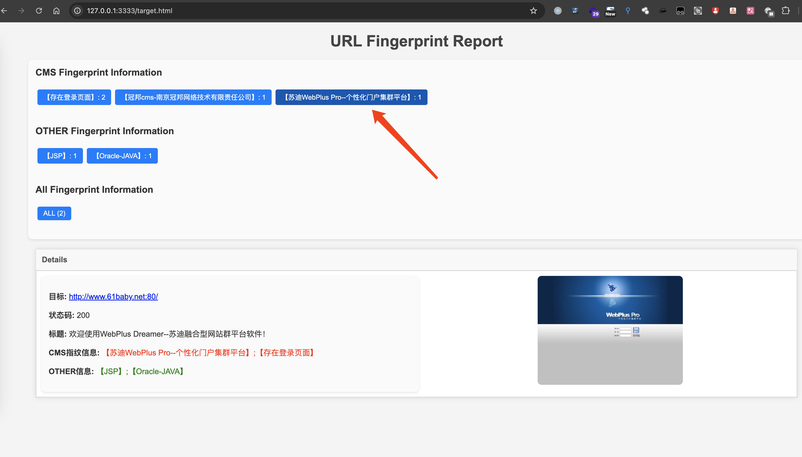

# httpgo

## 关于
httpgo是一个web指纹识别工具，支持多线程、HTTP代理、批量识别、保存结果、截图展示。可自行添加指纹。

## 使用
### 帮助
```
[shym]% go run main.go -h

 _       _     _
| |__   | |_  | |_   _ __     __ _    ___
| '_ \  | __| | __| | '_ \   / _' |  / _ \
| | | | | |_  | |_  | |_) | | (_| | | (_) |
|_| |_|  \__|  \__| | .__/   \__, |  \___/
                    |_|      |___/

Usage of :
  -check
    	检查新添加指纹规则的合规性
  -file string
    	请求的文件
  -fingers string
    	指纹文件 (default "fingers.json")
  -hash string
    	计算hash
  -output string
    	输出结果文件夹名称,不用加后缀(包含csv,json,html文件) (default "output")
  -proxy string
    	添加代理
  -server string
    	指定需要远程访问的output的文件夹名称，启动web服务，自带随机密码，增加安全性
  -thead int
    	并发数 (default 20)
  -timeout duration
    	超时时间 (default 8ns)
  -url string
    	请求的url
```
### 单个url识别


### 批量url识别
-file 指定批量url文件，每行一个url

-output 指定输出文件夹名称，不用加后缀，会在指定的文件夹生成csv,json,html文件

-thead 指定并发数，未设置默认20



会在指定的-output的路径下生成对应的result.csv表格文件



同时也会生成result.html网页文件和指纹信息result.json文件

如果想查看result.html页面，可以使用-server 开启web服务，自动生成一个加密的web服务






当输入账号密码认证过后，可直接访问根目录，下载csv文件，方便在服务器部署时，下载csv结果




或在html结果路径下使用python3 -m http.server 3333起一个web服务



访问target.html



点击对应的蓝色按钮可仅查看对应指纹信息如点击【苏迪WebPlus Pro--个性化门户集群平台】




## 指纹规则

~~~
title="xxxxx" 匹配title的内容
header="Server: bbbb"	匹配响应标头Server的内容
icon_hash="1111111"	匹配favico.ico图标hash内容
body="cccc"	匹配body中的内容
cert="dddd"	匹配证书中内容
body="xxxx" && header!="ccc" 匹配body中包含xxxx并且header中不包含ccc的内容

=为包含关系，即包含关系即可匹配
!=为不包含关系，即不包含关系即可匹配

支持逻辑 && 以及 || 和 ()比如
body=\"aaaa\" && (title=\"123\" || title=\"456\")

双引号"记得转义，如果是搜索的具体内容里有"需要在"前加\\\",如
body=\"<link href=\\\"/jcms/\" 匹配的为body中是否包含<link href="/jcms/

{
  "name": "jcms or fcms",
  "keyword": "body=\"<link href=\\\"/jcms/\" || body=\"<link href=\\\"/fcms/\" || body=\"jcms/Login.do\" || body=\"fcms/Login.do\""
}

如果是搜索的具体内容里有&或|需要在他们前面使用\\,如
body=\"1234\\&\\&1111\" 匹配的为body中是否包含1234&&1111
~~~


