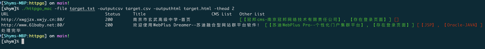
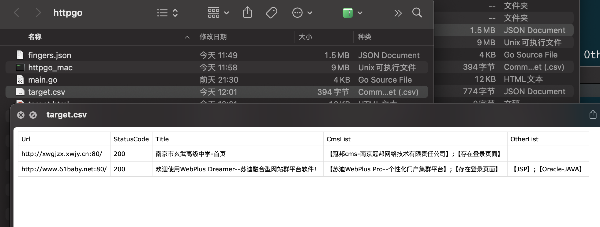

# httpgo

## 关于
httpgo是一个web指纹识别工具，支持多线程、HTTP代理、批量识别、保存结果、截图展示。可自行添加指纹。

## 使用
### 帮助
```
[shym]% ./httpgo_mac -h                                                          
Usage of ./httpgo_mac:
  -file string
        请求的文件 (default "target.txt")
  -fingers string
        指纹文件 (default "fingers.json")
  -hash string
        计算hash
  -outputcsv string
        输出文件 (default "output.csv")
  -outputhtml string
        输出文件 (default "report.html")
  -proxy string
        添加代理
  -thead int
        并发数 (default 20)
  -timeout duration
        超时时间 (default 15ns)
  -url string
        请求的url
```
### 单个url识别


### 批量url识别
-file 指定批量url文件，每行一个url

-outputcsv 保存结果到文件，仅支持csv格式，未设置默认输出到output.csv

-outputhtml 保存结果到文件，仅支持html格式，未设置默认输出到report.html

-thead 指定并发数，未设置默认20



会在程序路径下生成target.csv表格文件



同时也会生成target.html网页文件和指纹信息target.json文件

在当前路径下使用python3 -m http.server 3333起一个web服务


访问target.html


点击对应的蓝色按钮可仅查看对应指纹信息如点击【苏迪WebPlus Pro--个性化门户集群平台】


## 指纹规则

~~~
title="xxxxx" 匹配title的内容
header="bbbb"	匹配响应标头的内容
icon_hash="1111111"	匹配favico.ico图标hash内容
body="cccc"	匹配body中的内容
cert="dddd"	匹配证书中内容
body="xxxx" && header!="ccc" 匹配body中包含xxxx并且header中不包含ccc的内容

=为包含关系，即包含关系即可匹配
!=为不包含关系，即不包含关系即可匹配

支持逻辑&& 以及 || 和 ()
比如
body=\"aaaa\" && (title=\"123\" || title=\"456\")

双引号"记得转义，如果是搜索的具体内容里有"需要加使用\\\",如
body=\"<link href=\\\"/jcms/\" 匹配的为body中是否包含<link href="/jcms/

{
  "name": "jcms or fcms",
  "keyword": "body=\"<link href=\\\"/jcms/\" || body=\"<link href=\\\"/fcms/\" || body=\"jcms/Login.do\" || body=\"fcms/Login.do\""
}
~~~


